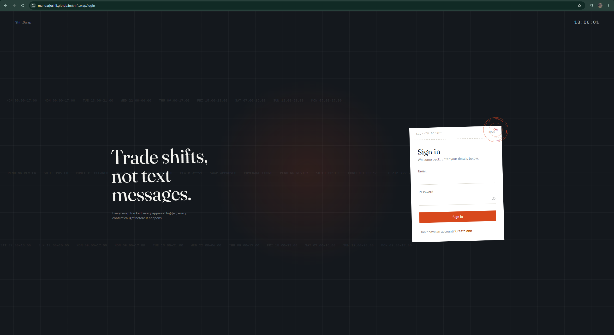
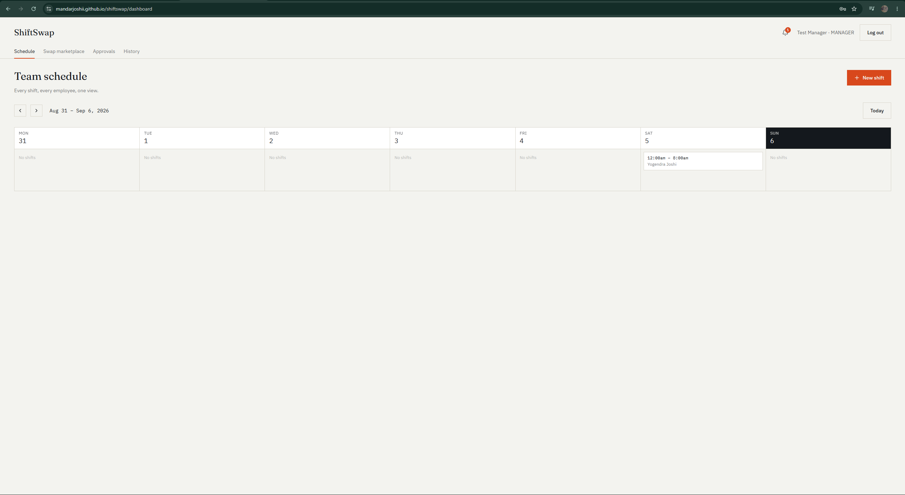
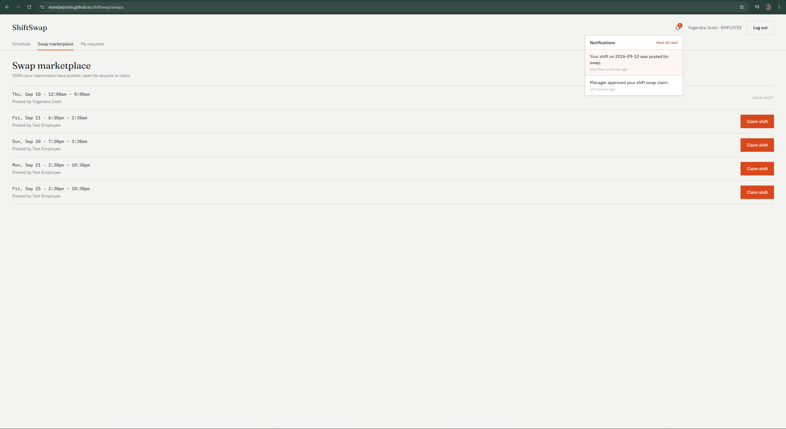

# ShiftSwap

**Trade shifts, not text messages.**

A full-stack shift scheduling and swap platform for businesses with hourly, shift-based employees — built end-to-end in 7 days as a portfolio project.

**Live demo:** [https://mandarjoshii.github.io/shiftswap/](https://mandarjoshii.github.io/shiftswap/)
**Repository:** [https://github.com/MandarJoshii/shiftswap](https://github.com/MandarJoshii/shiftswap)

> Note: the backend runs on Render's free tier, which spins down after inactivity. The first request after idle time may take 30–60 seconds to wake up — subsequent requests are fast.

## Screenshots

**Sign in**


**Team schedule**


**Swap marketplace**


---

## The problem

Shift-based teams routinely swap shifts over WhatsApp groups, texts, and phone calls. That creates real, recurring problems:

- Managers have no visibility into who's actually working
- Employees can accidentally double-book themselves across overlapping shifts
- Swap approvals get lost in chat threads with no audit trail
- There's no single source of truth for the schedule

## The solution

ShiftSwap centralizes scheduling and shift-swapping into one application with two roles, a defined swap approval lifecycle, and automatic conflict detection that makes double-booking structurally impossible rather than something to catch after the fact.

---

## Features

**Employees can:**
- View a weekly schedule shared with their team
- Post one of their own shifts for swap
- Browse and claim shifts other employees have posted
- Track the status of swaps they've posted or claimed
- Receive in-app notifications on swap activity

**Managers can:**
- Create, edit, and delete shifts, assigned or unassigned
- View the full team schedule
- Approve or reject pending swap requests
- View a complete audit trail of scheduling and swap activity

**Across the app:**
- Role-based access control (JWT + middleware, enforced on every route, not just hidden in the UI)
- Automatic conflict detection — an employee cannot claim a shift that overlaps a shift they already hold
- A full swap lifecycle state machine: `PENDING → APPROVED` or `PENDING → REJECTED`, with automatic rejection of competing claims once one is approved
- 20 automated backend tests covering auth, RBAC, and conflict detection, run in CI on every push

---

## Tech stack

**Frontend:** React, TypeScript, Vite, Tailwind CSS v4, React Router, TanStack Query, React Hook Form, Zod, Framer Motion
**Backend:** Node.js, Express, TypeScript, Prisma ORM
**Database:** MySQL (hosted on Aiven)
**Auth:** JWT, bcrypt
**Testing:** Jest, Supertest
**CI/CD:** GitHub Actions
**Deployment:** Render (backend), GitHub Pages (frontend)

---

## Architecture

A monorepo with two independent apps:

shiftswap/
├── frontend/ React + Vite SPA, deployed to GitHub Pages
├── backend/ Express API, deployed to Render
│ └── src/
│ ├── modules/ # auth, users, shifts, swaps, notifications, audit
│ │ └── <module>/ # controller → service → routes → validation
│ ├── middleware/ # JWT auth, role-based access control, error handling
│ └── utils/ # shared Prisma client, JWT helpers, base error class
└── .github/workflows/ # CI: backend tests + frontend build


Each backend module follows a consistent **controller → service → routes** split: routes map URLs to controllers, controllers handle HTTP request/response shape, and services hold the actual business logic (including conflict detection and the swap-approval transaction) with no knowledge of Express at all. A shared `AppError` base class lets every module define its own typed errors while one centralized error-handling middleware translates all of them into consistent HTTP responses.

## Database design

Five tables: `User`, `Shift`, `SwapRequest`, `Notification`, `AuditLog`.

- A `Shift` has an optional `employeeId` (a manager can create an unassigned shift) and a required `createdById` (the manager who made it) — two distinct relations to `User`.
- A `SwapRequest` references a `Shift` plus the requesting and claiming employees separately from the shift's own fields, because a single shift can go through multiple swap attempts over time and that history needs to be preserved, not overwritten.
- A composite index on `Shift(employeeId, date)` backs the conflict-detection query directly.
- `AuditLog` is intentionally generic (`action`, `entityType`, `entityId`, `metadata` as JSON) rather than one table per event type, avoiding near-duplicate schema for what is fundamentally the same kind of record.

## Conflict detection

The core requirement of the project: an employee cannot end up double-booked. Before a claim is created, the backend checks for any existing shift belonging to that employee where: 
existingShift.startTime < newShift.endTime AND existingShift.endTime > newShift.startTime|


This single comparison correctly catches full overlaps, partial overlaps on either edge, and one shift nested inside another, while correctly allowing shifts that are merely back-to-back (one ending exactly when another begins). This exact boundary case is covered by an automated test, not just manually verified.

Shift reassignment on approval, and the automatic rejection of any other pending claims on the same shift, happen inside a single Prisma database transaction — either all three effects apply together, or none do.

## Authentication & authorization

- Passwords hashed with bcrypt (never stored or returned in plaintext)
- JWTs signed with a server-side secret, carrying only `userId` and `role`
- `requireAuth` middleware verifies the token on every protected route
- `requireRole` middleware enforces role restrictions (e.g. only managers can create shifts or approve swaps) at the route level — this is enforced server-side regardless of what the frontend UI shows or hides
- Login and registration return the same generic error message for "wrong password" and "unknown email," a deliberate choice to avoid confirming which emails are registered

---

## Local development

### Prerequisites
- Node.js 18+
- A MySQL database (e.g. a free Aiven instance)

### Backend

```bash
cd backend
npm install
cp .env.example .env   # fill in DATABASE_URL, JWT_SECRET, TEST_DATABASE_URL
npx prisma generate
npx prisma migrate deploy
npm run dev             # runs on http://localhost:4000
```

### Frontend

```bash
cd frontend
npm install
cp .env.example .env   # VITE_API_URL=http://localhost:4000
npm run dev              # runs on http://localhost:5173
```

## Environment variables

**Backend (`backend/.env`):**

| Variable | Description |
|---|---|
| `PORT` | Port the server listens on locally (Render assigns its own in production) |
| `DATABASE_URL` | MySQL connection string for the main database |
| `JWT_SECRET` | Secret used to sign JWTs — generate with `node -e "console.log(require('crypto').randomBytes(32).toString('hex'))"` |
| `TEST_DATABASE_URL` | A separate MySQL database used only by the automated test suite |

**Frontend (`frontend/.env`):**

| Variable | Description |
|---|---|
| `VITE_API_URL` | Base URL of the backend API |

## Testing

```bash
cd backend
npm test
```

20 tests across three suites (auth, shifts/RBAC, conflict detection), run serially against a dedicated test database, isolated from development data. In CI, the same suite runs against a disposable MySQL container via GitHub Actions on every push to `main`.

## Deployment

- **Database:** Aiven (free-tier MySQL)
- **Backend:** Render, deployed from `backend/` with `npm run build` / `npm run start`
- **Frontend:** GitHub Pages, built with a `/shiftswap/` base path and deployed via the `gh-pages` package; includes the standard SPA redirect trick (`404.html` + a matching decode script in `index.html`) since GitHub Pages has no server-side routing for client-side routes

---

## Future improvements

Honest scope decisions made under a 7-day constraint, not oversights:

- Real-time updates via WebSockets instead of the current 30-second notification polling
- Frontend automated tests (backend test coverage was prioritized given the time available)
- Code-splitting the frontend bundle (currently one ~560KB chunk)
- A dedicated invite/company system rather than open self-selected roles at registration
- Recurring/templated shifts
- A `COMPLETED` swap status transition once a shift's date has passed (currently `APPROVED` is the practical end state)

## Author

Built by Mandar Joshi.
